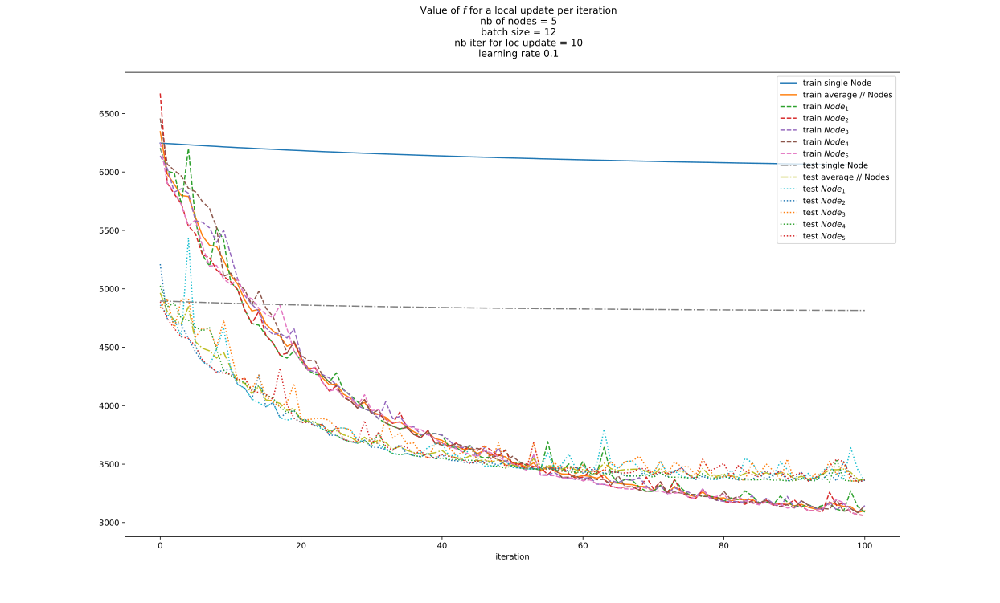
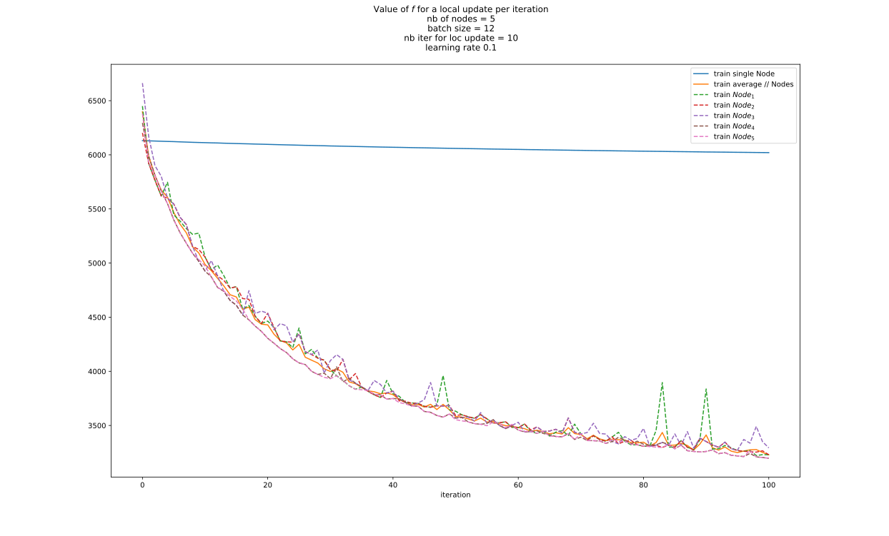
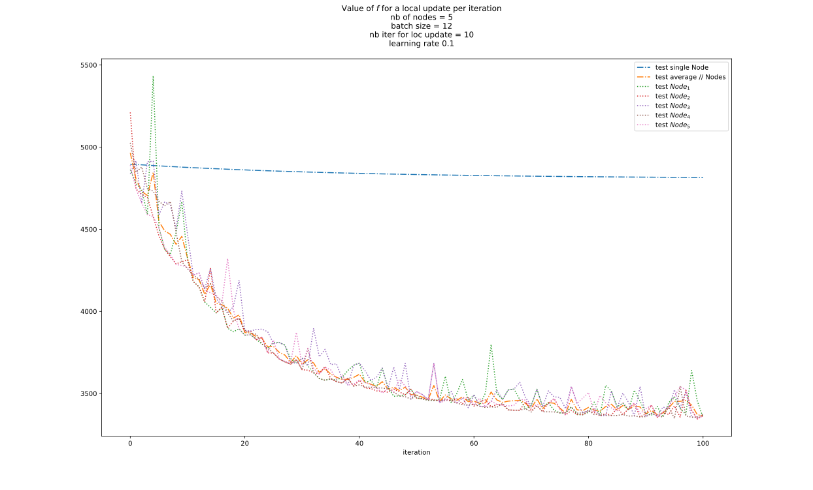
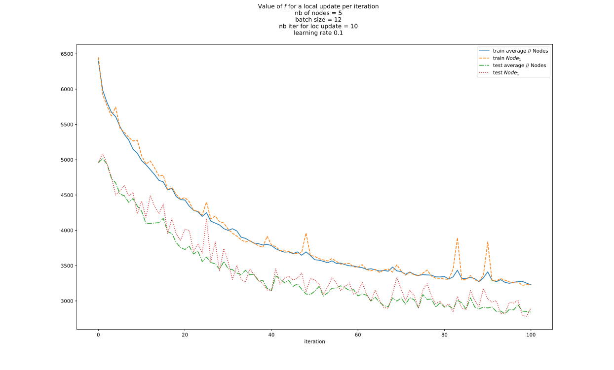
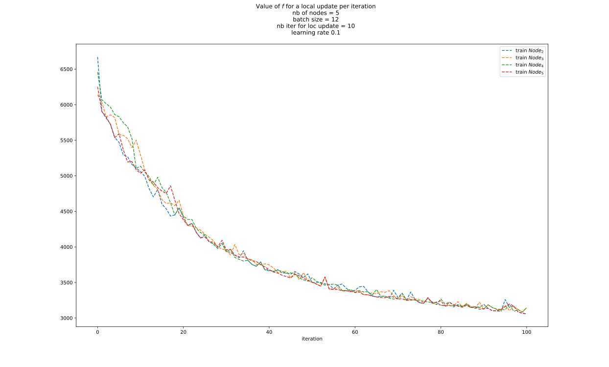

# distFedPAQ-simulation

## About

You can find this repo at <https://github.com/aheritianad/distFedPAQ-simulation>.

A copy is available here <https://gitfront.io/r/aheritianad/Jf8eQDMabdcc/distFedPAQ-simulation/>.

## Installation

1. Get a copy of this repo by
    - *cloning* with **git**
        - **GITHUB**
            >`git clone https://github.com/aheritianad/distFedPAQ-simulation.git`
        - A copy on **GITFRONT**
            >`git clone https://gitfront.io/r/aheritianad/Jf8eQDMabdcc/distFedPAQ-simulation.git`
    - or by **downloading** a compressed version (`.zip`) at <https://github.com/aheritianad/distFedPAQ-simulation/zipball/master>.
  
2. Enter into the directory  
    `cd distFedPAQ-simulation`

3. **[OPTIONAL but RECOMMENDED]** Use a virtual environment
    - Make a virtual environment `.venv` with
        > `python3 -m venv .venv`
    - Activate the virtual environment with
        > `source .venv/bin/activate`

        You can deactivate `.venv` anytime with the `deactivate` command.

4. Install all dependencies
     > `pip3 install -r ./distFedPAQ/requirements.txt`

## Usage

### Commands

1. See help for the arguments
   > `python3 main.py --help` or `python3 main.py -h`
2. Example of a simulation command
   > `python -i main.py -n 5 -loc 10 -ext 100 -n-ext-ave 2 -bs 12 -lr 1e-1 -mom 0 -tr seq -rs 5`

I got the following result by running the above command on `diabetes` of `scikit-learn`:

| Code                                                          | Plots                                                    | Note                                                                      |
| ------------------------------------------------------------- | -------------------------------------------------------- | ------------------------------------------------------------------------- |
| `plot(stop=-1)`                                               |  | All in one                                                                |
| `plot(stop=-1,test=False)`                                    |              | On `train dataset`                                                        |
| `plot(stop=-1,train=False)`                                   |                | On `test dataset`                                                         |
| `plot(1, single=False)`                                       |             | $Node_{1}$                                                                |
| `plot(start=2, stop=-1, single=False, ave=False, test=False)` |    | from $Node_{2}$ to the last node (i.e. $Node_{5}$) on the `train dataset` |

### Arguments

- `-n` or `--nodes`  
  number of nodes
- `-loc` or `--local-update`  
  number of iterations per node for each local update. Default to `10`.
- `-n-ext-ave` or `--nodes-external-averaging`  
  number nodes will update externally by averaging. Default to `2`.
- `-ext` or `--external-update`  
  number of time that some nodes (see `-n-ext-ave`) will update externally by averaging. Default to `100`.
- `-bs` or `--batch-size`  
  size of a batch from local data of a node in each iteration of its local update. Default to `1`.
- `-lr` or `--learning-rate`  
  learning rate for nodes' local update. Default to `1e-3`.
- `-mom` or `--momentum`  
  momentum for a local update. Value in `[0,1)`. Default to `0`.
- `-bias` or `--with-bias`  
  Flag for using `bias` for the model [`y`/`n`]. Default to `y`.
- `-tr` or `--trainer`  
  trainer for the nodes [[`seq`/`sequential`]/[`par`/`parallel`]]. Default to `seq`.
- `-rs` or `--repeat-single`  
  number of time that the `single node` will do loops of local updates **before** evaluation. Default to `1`.
- `-P-path` or `--path-to-probability-P`  
  path to the probability file (`csv type`) which encode the graph. If not set, probability will be uniform on all nodes.

### Notes

1. I recommend to use `-tr seq` when `-loc` is *small* (<=3000) and `-tr par` otherwise.
2. In order to get more flexibility, it is recommended to run in interactive mode (i.e. `python3 -i ...`).

## Author

Heritiana Daniel Andriasolofo  

- [x] github : [aheritianad](https://github.com/aheritianad)
- [x] linkedin : [aheritianad](https://linkedin.com/in/aheritianad)
- [x] gmail : [aheritianad](mailto:aheritianad@gmail.com)
