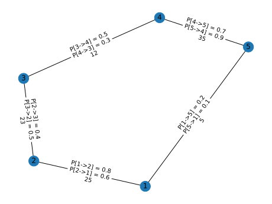

# distFedPAQ-simulation

## About

You can find this repo at <https://github.com/aheritianad/distFedPAQ-simulation>.

A copy is available here <https://gitfront.io/r/aheritianad/Jf8eQDMabdcc/distFedPAQ-simulation/>.

## Installation

1. Get a copy of this repo by
    - *cloning* with **git**
        - **GITHUB**
            >`git clone https://github.com/aheritianad/distFedPAQ-simulation.git`
        - A copy on **GITFRONT**
            >`git clone https://gitfront.io/r/aheritianad/Jf8eQDMabdcc/distFedPAQ-simulation.git`
    - or by **downloading** a compressed version (`.zip`) at <https://github.com/aheritianad/distFedPAQ-simulation/zipball/master>.
  
2. Enter into the directory  
    `cd distFedPAQ-simulation`

3. **[OPTIONAL but RECOMMENDED]** Use a virtual environment
    - Make a virtual environment `.venv` with
        > `python3 -m venv .venv`
    - Activate the virtual environment with
        > `source .venv/bin/activate`

        You can deactivate `.venv` anytime with the `deactivate` command.

4. Install all dependencies
     > `pip3 install -r ./distFedPAQ/requirements.txt`

## Usage

### Commands

1. See help for the arguments
   > `python3 simulator.py --help` or `python3 simulator.py -h`
2. Example of a simulation command
   > `python -i simulator.py -n 5 -loc 10 -ext 100 -n-ext-ave 2 -bs 12 -lr 1e-1 -mom 0 -tr seq -P-path proba/ring_5.csv -rs 5`

I got the following result by running the above command on `diabetes` of `scikit-learn`:

| Code                                                          | Plots                                                    | Note                                                                           |
| ------------------------------------------------------------- | -------------------------------------------------------- | ------------------------------------------------------------------------------ |
| `plot(stop=-1)`                                               |  | All in one                                                                     |
| `plot(stop=-1,test=False)`                                    |              | On `train dataset`                                                             |
| `plot(stop=-1,train=False)`                                   |                | On `test dataset`                                                              |
| `plot(1, single=False)`                                       |             | $Node_{1}$                                                                     |
| `plot(start=2, stop=-1, single=False, ave=False, test=False)` |    | from $Node_{2}$ to the last node (i.e. $Node_{5}$) on the `train dataset`      |
| `plot_graph(show_contact=False)`                              |   | Graph whit only probabilities.                                                 |
| `plot_graph()`                                                |         | Graph with probabilities and number of contacts between nodes during training. |

### Arguments

#### Required

| Short | Long      | Description      |
| ----- | --------- | ---------------- |
| `-n`  | `--nodes` | Number of nodes. |

#### Optional

| Short        | Long                         | Description                                                                                                             | Default value          |
| ------------ | ---------------------------- | ----------------------------------------------------------------------------------------------------------------------- | ---------------------- |
| `-loc`       | `--local-update`             | Number of iterations per node for each local update.                                                                    | `10`                   |
| `-n-ext-ave` | `--nodes-external-averaging` | Number nodes will update externally by averaging.                                                                       | `2`                    |
| `-ext`       | `--external-update`          | Number of time that some nodes (see `-n-ext-ave`) will update externally by averaging.                                  | `100`                  |
| `-bs`        | `--batch-size`               | Size of a batch from local data of a node in each iteration of its local update.                                        | `1`                    |
| `-lr`        | `--learning-rate`            | Learning rate for nodes' local update.                                                                                  | `1e-3`                 |
| `-mom`       | `--momentum`                 | Momentum for a local update. Value in `[0,1)`.                                                                          | `0`                    |
| `-bias`      | `--with-bias`                | Flag for using `bias` for the model [`y`/`n`].                                                                          | `y`                    |
| `-tr`        | `--trainer`                  | Trainer for the nodes [[`seq`/`sequential`]/[`par`/`parallel`]].                                                        | `seq`                  |
| `-rs`        | `--repeat-single`            | Number of time that the `single node` will do loops of local updates **before** evaluation.                             | `1`                    |
| `-P-path`    | `--path-to-probability-P`    | Path to the probability file (`csv type`) which encode the graph. If not set, probability will be uniform on all nodes. | `P` will be a uniform. |

### Notes

1. I recommend to use `-tr seq` when `-loc` is *small* (<=3000) and `-tr par` otherwise.
2. In order to get more flexibility, it is recommended to run in interactive mode (i.e. `python3 -i ...`).

## Author

Heritiana Daniel Andriasolofo  

- [x] github : [aheritianad](https://github.com/aheritianad)
- [x] linkedin : [aheritianad](https://linkedin.com/in/aheritianad)
- [x] gmail : [aheritianad](mailto:aheritianad@gmail.com)
